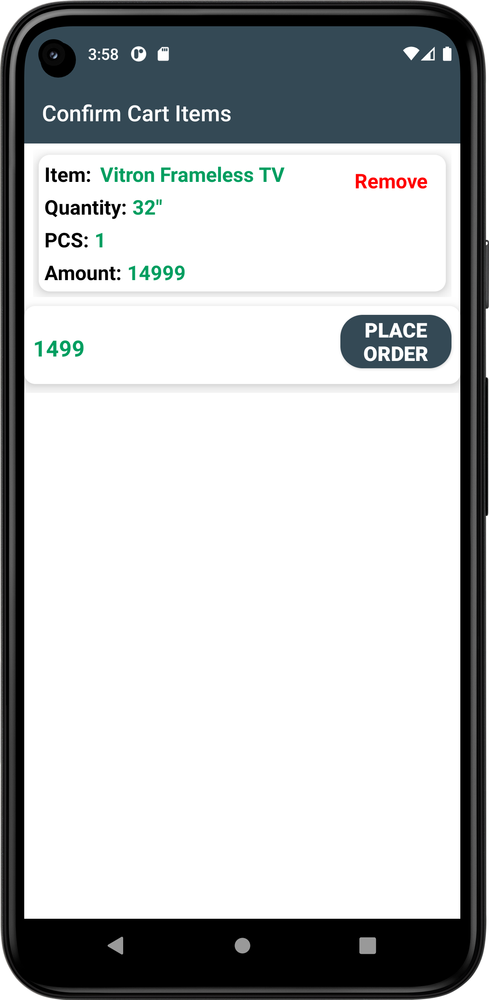

# UpendoShop
# Status :white_check_mark:  DONE :white_check_mark:.
UpendShop App is an android application that will enable an admin manage products, users and orders as well as allow customers view products and make order  then pay using mpesa using the Safaricom Daraja Api for Online payments. Authentication and Storage is done using Firebase data persistence is implemented using sqlite.
## TechStack
* Java- `Backend.`
* XMLs- `Frontend.`
* Gradle- `(For Project building).`
* Postman `For testing the end points.`
* Firebase- `User Auth and storage.`
* Sql- `For persistence data storage and retrieval`
* Junit- `Testing`
* Daraja Api- `For Lipa na Mpesa Online`

## SCREENSHOTS
 

## Setup & Installation
* Clone the project into your machine from `https://github.com/johnkaizer/Changisha-App.git`
* Run the project in the forked root folder- gradle run.

# Upendo Android App (Lipa naMpesa Online)
This section talks of how to impeliment Lipa Na MPESA Online.
Documentation on the API can be found on [Safaricom Developer Portal] (https://developer.safaricom.co.ke/docs)

### Requirements

* JDK Version 1.7 & above
* Android Studio

### Getting Safaricom Credentials
1. Create an account on the [Safaricom Developer Portal] (https://developer.safaricom.co.ke/)
2. Create a Lipa na MPESA Online App
Import the libraries below
### Libraries Used
1. [Sweet alerts] (https://github.com/pedant/sweet-alert-dialog)
2. [Butterknife] (https://github.com/JakeWharton/butterknife)
3. [Retrofit] (http://square.github.io/retrofit/)
4. [GSON] (https://github.com/google/gson)
5. [FireBase] (https://firebase.google.com/docs/android/setup)
6. [Okhttp] (http://square.github.io/okhttp/)
7. [okio] (https://github.com/square/okio)
8. [OkHttp Interceptors](https://github.com/square/okhttp/wiki/Interceptors)
9. [Timber] (https://github.com/JakeWharton/timber)

## Dependencies
1. [Circle Imagevie] ( implementation 'de.hdodenhof:circleimageview:3.1.0')
2. [Loading Images] ( implementation 'com.squareup.picasso:picasso:2.8')

## Development
For contributions.!
To fix a bug or enhance an existing module, follow these steps:

- Fork the repo
- Create a new branch (`git checkout -b improve-feature`)
- Make the appropriate changes in the files
- Add changes to reflect the changes made
- Commit your changes (`git commit -am 'Improve feature'`)
- Push to the branch (`git push origin improve-feature`)
- Create a Pull Request
